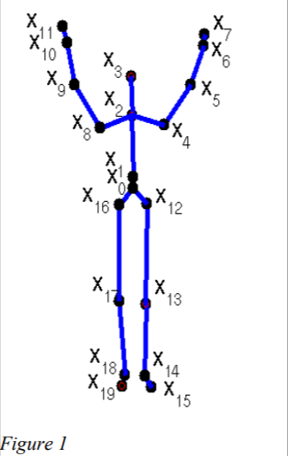

# GestureClassification_BayesianNetworks
To classify body gesture with naive bayesian model and linear gaussian model using human body joint positions from the MSRC-12 Kinect gesture dataset of Microsoft Research Cambridge.

The fraction of the dataset we will be working on consists in 2045 instances of body positions for 4 classes: “arms lifted”, “right arm extended to one side”, “crouched” and “right arm extended to the
front”. The body positions are encoded using a 20x3 matrix where each row is the position in space (x,y,z) of each of the 20 joints.

 The order in which the different joints appear in the vector are shown in Figure 1 for one instance of class both arms
lifted. The data is in a matlab file data.mat. To load the data in python use scipy.io.loadmat function. The content of the files is: 
- data: a 3D matrix with dimensions #joints x 3 x #instances. In this case is 20x3x2045. 
- labels: a vector with the class label for each instance.
- individuals: a vector with the identification of each individual.
The skeleton definition, i.e. the connections between these points, are specified at the beginning of the python notebook given.

